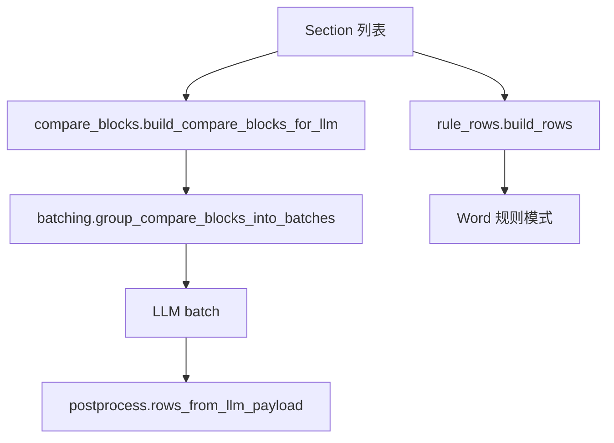

# 切块与预处理（chunking）开发指引

本文档说明 `file-comparison` 在 **章节型正文 → compare block / unit → LLM 批次** 阶段的模块分工，以及新逻辑应落在哪个子模块。

- 业务规则总览见 [PROCESSING_REQUIREMENTS.md](./PROCESSING_REQUIREMENTS.md)
- 模型结果后处理见 [postprocess-development-guide.md](./postprocess-development-guide.md)
- 任务编排与多 batch 合并见 [engine-development-guide.md](./engine-development-guide.md)
- 实现根目录：`skills/file-comparison/src/file_comparison/compare/chunking/`

各子模块文件顶部的模块注释与本文档保持一致；**新增或调整职责时，应同步更新本文档与对应模块注释**。

## 1. 文档定位

| 层级 | 内容 | 典型位置 |
| --- | --- | --- |
| 业务「要什么」 | 章节对齐、父标题顺延、送模粒度 | `docs/PROCESSING_REQUIREMENTS.md` |
| 抽取与章节切分 | Word 文本、一级 `Section` | `compare/extractor.py`、`compare/section_rules.py` |
| 切块与送模候选 | compare block、批次计划 | `compare/chunking/`（本文档） |
| 模型与后处理 | operation、对照行 | `prompts/`、`compare/postprocess/` |

`chunking` 只处理已切好的 `Section` 列表，不读 Word 文件，也不调用 LLM。

## 2. 数据形态与边界

| 形态 | 说明 | 典型产出 |
| --- | --- | --- |
| `Section` | 一级章节 number / title / body | `extractor.split_sections` |
| `ComparisonRow` | 本地规则 diff 的对照行 | `rule_rows.build_rows` |
| `CompareBlock` | 父标题块 + old/new `CompareBlockItem` | `compare_blocks.build_compare_blocks_for_llm` |
| `CompareUnit` | 条目级单元（兼容/诊断路径） | `compare_units.build_compare_units_for_llm` |
| `ChapterBatch` | 送模批次 | `batching.group_compare_blocks_into_batches` |

**块内条目**（`section_items` / `compare_blocks`）与 **批次切分**（`batching`）是两条边界：前者决定「送什么块」，后者决定「几块一批」。

## 2.1 一级章节顺序

合并旧版与新版 `Section` 时，章节号列表不再沿用「先遍历 old 再补 new」的插入顺序（会导致仅新版存在的靠前章节被排到末尾）。统一使用 `extractor.ordered_unique_section_numbers`：对 `第N部分` 按中文数字 **N** 升序排序，与合同原文阅读顺序一致；无法解析的章节号排在后面并按字符串次序稳定排序。

## 3. 流水线位置



- **LLM 主路径**：`engine.pair_compare` / `rerender` 调用 `build_compare_blocks_for_llm` → `group_compare_blocks_into_batches`。
- **规则模式**：`build_rows` 直接生成 `ComparisonRow`，不经过 compare block。
- **兼容路径**：`build_compare_units_for_llm`、`preprocess_sections_for_llm` 供 CLI 诊断或旧形态；正式引擎以 compare block 为准。

## 4. 模块职责一览

| 模块 | 处理对象 | 职责 | 不负责 |
| --- | --- | --- | --- |
| `__init__.py` | 包入口 | 对外 re-export，保持 `from ..chunking import ...` 稳定 | 具体算法 |
| `constants.py` | 正则与常量 | 标题模式、`OMITTED_EQUAL_MARKER`、邻域窗口等 | 业务决策 |
| `headings.py` | 行/段文本 | 内部标题识别、小标题提取、结构父标题判定 | compare block 构建 |
| `text_match.py` | 行/段文本 | 去编号比较、仅编号变化、全同行裁剪、小标题匹配 | 块级 diff opcode |
| `blocks.py` | 章节行列表 | 按标题切块、`block_match_key` | 跨章节对齐 |
| `rule_rows.py` | `Section` | 本地规则 diff → `ComparisonRow` | LLM payload |
| `section_items.py` | `Section` | 正文拆条、父标题分组 | 批次切分 |
| `compare_blocks.py` | `Section` | 构建 `CompareBlock`、块内条目过滤、送模展示文本 | operation 语义 |
| `compare_units.py` | `Section` | unit 构建、章节压缩送模 | 正式 batch 编排 |
| `batching.py` | `CompareBlock` / `CompareUnit` | 按章数/字数/块数分批、超长块拆分 | 模型调用 |

## 5. 改动应落在哪（决策表）

| 现象或需求 | 落点模块 |
| --- | --- |
| 标题正则、省略号标记、邻域窗口常量 | `constants.py` |
| 小标题是否重复、多行标题、父标题长度 | `headings.py` |
| 「仅编号变化」、左右全同行剔除 | `text_match.py` |
| 章节内按 `一、` / `1、` 切块 | `blocks.py` |
| 规则模式整章/整文档对照行 | `rule_rows.py` |
| 父标题顺延对齐、条目拆成 old/new item | `section_items.py` + `compare_blocks.py` |
| 送模前剔除完全一致条目、块内邻域去噪 | `compare_blocks.filter_compare_block_items_by_stripped_numbering_identity` |
| 单章多父块、整章未变跳过 | `compare_blocks.build_compare_blocks_for_llm` |
| `chapter_batch_size`、超长批、单块按 item 拆分 | `batching.py` |
| 模型 operation、对照行合并 | `postprocess/`（不在 chunking） |
| Word 抽取、签署页跳过 | `extractor` / `section_rules` |

## 6. 依赖方向

- `constants` 无包内依赖。
- `headings` → `constants`；`text_match` → `constants`、`headings`。
- `blocks` → `headings`、`text_match`。
- `rule_rows` → `blocks`、`headings`、`text_match`。
- `section_items` → `blocks`、`headings`、`rule_rows`（`body_lines_without_title`）。
- `compare_blocks` → `section_items`、`text_match`。
- `compare_units` → `compare_blocks`、`rule_rows`。
- `batching` → `models`；块拆分函数与 `compare_blocks` 内条目结构一致，但不在 import 上回指 `compare_blocks` 以免循环。

新增子模块时避免 `batching` ↔ `compare_blocks` 互相 import。

## 7. 对外 API 约定

- 外部代码（`engine`、`rerender`、`batch_processor`、`writer`、`postprocess`、测试）优先 `from file_comparison.compare.chunking import ...` 或 `from ..chunking import ...`，不深入子模块路径。
- 新公开函数加入 `chunking/__init__.py` 的 `__all__`。
- 仅子模块内部使用的 `_` 前缀函数不要导出。

## 8. 测试与回归

- 目录：`tests/skills/file-comparison/`
- 切块与 compare block：`test_file_comparison.py` 中 `build_compare_blocks_*`、`preprocess_sections_*`、`group_*` 等。
- 全量回归（项目根目录）：

```bash
uv run python -m pytest tests/skills/file-comparison/ -q
```

## 9. 常见反模式

- 在 `batching` 里改标题识别或仅编号判定。
- 在 `rule_rows` 里写 LLM operation 纠偏。
- 为单份样例在 `compare_blocks` 硬编码章节号，而不更新 `PROCESSING_REQUIREMENTS.md`。
- 新增逻辑不补测试，或只改子模块不更新 `__init__.py` 导出导致外部仍从旧路径拷贝代码。

## 10. 路径速查

| 用途 | 路径 |
| --- | --- |
| 切块包 | `skills/file-comparison/src/file_comparison/compare/chunking/` |
| 规则对照行 | `chunking/rule_rows.py` → `build_rows` |
| 送模块 | `chunking/compare_blocks.py` → `build_compare_blocks_for_llm` |
| 批次 | `chunking/batching.py` → `group_compare_blocks_into_batches` |
