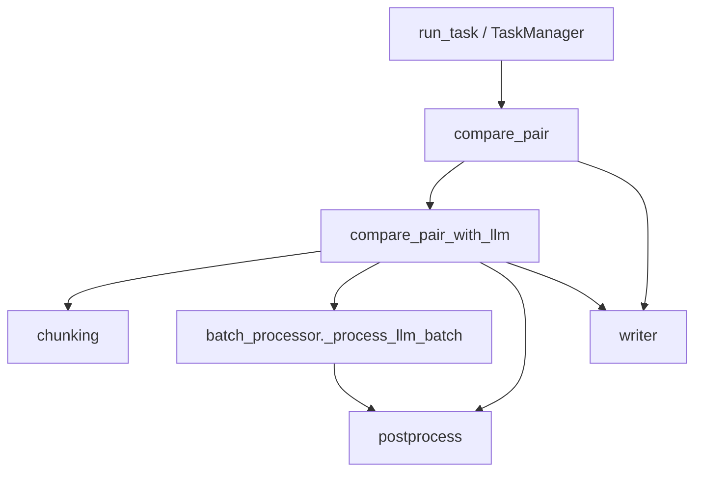

# 任务编排（engine）开发指引

本文档说明 `file-comparison` 在 **扫描配对 → 单文件对比较 → 多 pair 任务落盘** 阶段的模块分工，以及新逻辑应落在哪个子模块。

- 业务规则总览见 [PROCESSING_REQUIREMENTS.md](./PROCESSING_REQUIREMENTS.md)
- 切块与送模批次见 [chunking-development-guide.md](./chunking-development-guide.md)
- 模型结果后处理见 [postprocess-development-guide.md](./postprocess-development-guide.md)
- 实现根目录：`skills/file-comparison/src/file_comparison/compare/engine/`

各子模块文件顶部的模块注释与本文档保持一致；**新增或调整职责时，应同步更新本文档与对应模块注释**。

## 1. 文档定位

| 层级 | 内容 | 典型位置 |
| --- | --- | --- |
| 配对与输出路径 | 文件名月份、产物命名 | `compare/pairing.py` |
| 单 pair 编排 | 抽取、LLM/规则分支、写 Word | `compare/engine/`（本文档） |
| 单 batch LLM | 请求、解析、落盘 | `compare/batch_processor.py` |
| 切块 | compare block、批次 | `compare/chunking/` |
| 后处理 | payload → 对照行 | `compare/postprocess/` |
| 网页后台 | 线程任务、重跑 batch | `engine/task_manager.py` |

`engine` 负责 **编排与状态**，不在此包内实现 diff 算法或 prompt 正文。

## 2. 单文件对主路径

### 2.1 `compare_pair`（`pair_compare.py`）

1. 抽取全文 → `split_sections` → `apply_section_skip_rules`
2. 落盘 `source/`、`extracted/old_sections.json` 等
3. `llm_mode == "responses"` → `compare_pair_with_llm`；否则 `build_rows` + 规则预处理产物
4. `normalize_product_name_rows` → `write_docx` / `convert_docx_to_doc`

### 2.2 `compare_pair_with_llm`（`pair_compare.py`）

1. `build_compare_blocks_for_llm` → `group_compare_blocks_into_batches`
2. 可选 `write_preprocess_artifacts`
3. 按 batch 恢复或 `_process_llm_batch` 并行
4. `validate_complete_batch_results`
5. 按 batch 顺序拼接 rows → `merge_consecutive_delete_rows` → `insert_section_title_change_rows` → `merge_pure_delete_and_add_runs`

### 2.3 多 pair 任务 `run_task`（`task_runner.py`）

扫描或复用 `pairs` → 逐 pair 调 `compare_pair` → 更新 `status.json`、checkpoint、`pair.json`。

### 2.4 网页 `TaskManager`（`task_manager.py`）

后台线程执行 `run_task`；`rerun_batch` 清理单 batch 现场后整任务恢复。



## 3. 模块职责一览

| 模块 | 职责 | 不负责 |
| --- | --- | --- |
| `__init__.py` | 对外稳定 API、re-export pairing/postprocess 常用符号 | 长流程实现 |
| `pair_compare.py` | 单 pair 抽取、模式分支、LLM 批次并行、多 batch 行合并 | 单次 HTTP 请求细节 |
| `batch_validation.py` | batch 是否齐全、可复用状态判定 | 发起重试 |
| `task_runner.py` | 多 pair 循环、任务级 status/checkpoint | 网页线程 |
| `task_manager.py` | 后台任务、batch 重跑清理 | 规则 diff 算法 |

## 4. 改动应落在哪（决策表）

| 现象或需求 | 落点 |
| --- | --- |
| 文件夹扫描、pair_id、输出文件名 | `pairing.py` |
| 签署页等章节跳过 | `section_rules.py`（经 `__init__` 再导出） |
| compare block 内容、分批策略 | `chunking/` |
| 模型请求、parsed 落盘、repair | `batch_processor.py` |
| operation 纠偏、对照行合并 | `postprocess/` |
| 单 pair 是否走 LLM、目录结构、写表前后顺序 | `pair_compare.py` |
| 全部 batch 是否有可用结果才允许出 doc | `batch_validation.py` |
| 任务级 status、checkpoint、pair 失败汇总 | `task_runner.py` |
| 页面「重跑 batch」、后台线程 | `task_manager.py` |
| 仅复用已落盘 parsed 重渲染 doc | `rerender.py`（非 engine 包，但调用相同 chunking/postprocess 合并顺序） |

## 5. 与 `rerender` 的边界

`rerender.py` 不重新请求模型，只复用 `llm/batch-*/` 的 parsed，合并顺序与 `compare_pair_with_llm` 末尾一致（连续删除 → 章题 → 纯删增）。改合并顺序时需 **同时** 检查 `pair_compare.py` 与 `rerender.py`。

## 6. 对外 API 约定

- 包入口：`from file_comparison.compare.engine import compare_pair, run_task, TaskManager, ...`
- `file_comparison/__init__.py` 仅导出 `compare_pair`、`run_task`；网页另用 `TaskManager`。
- 新增公开符号加入 `engine/__init__.py` 的 `__all__`。
- `_process_llm_batch`、`_write_readable_response_file` 为兼容导出，新代码优先从 `batch_processor` / `response_readable` 引用。

## 7. 测试与回归

- `test_file_comparison_checkpoint.py`：`compare_pair_with_llm` 恢复、TaskManager
- `test_file_comparison_llm.py`：批次并行、provider、落盘
- `test_file_comparison_pairing.py`：扫描与 pair_key（经 engine 再导出）

```bash
uv run python -m pytest tests/skills/file-comparison/ -q
```

## 8. 常见反模式

- 在 `task_runner` 内实现 compare block 过滤或 operation 折叠。
- 在 `pair_compare` 内直接改 prompt 或解析 schema（应改 `llm/`、`batch_processor`）。
- 只改 `compare_pair_with_llm` 合并顺序而不同步 `rerender.py`。
- batch 失败仍写正式 doc（应经 `validate_complete_batch_results` 拦截）。

## 9. 路径速查

| 用途 | 路径 |
| --- | --- |
| 编排包 | `skills/file-comparison/src/file_comparison/compare/engine/` |
| 单 pair | `engine/pair_compare.py` |
| 全任务 | `engine/task_runner.py` |
| 网页任务 | `engine/task_manager.py` |
| 单 batch LLM | `compare/batch_processor.py` |
