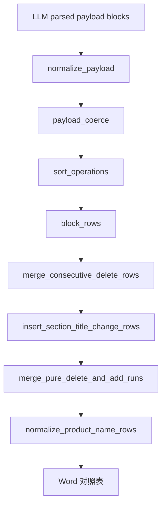

# 后处理（postprocess）开发指引

本文档说明 `file-comparison` 在 **模型结构化结果 → 最终对照行（`ComparisonRow`）** 阶段如何分工、代码应落在哪个模块，以及改动时应先改提示词还是后处理。

- 业务规则总览见 [PROCESSING_REQUIREMENTS.md](./PROCESSING_REQUIREMENTS.md)
- 切块与送模批次见 [chunking-development-guide.md](./chunking-development-guide.md)
- 任务编排见 [engine-development-guide.md](./engine-development-guide.md)
- 模型侧输出契约与操作语义见 [../prompts/compare-structured-instructions.md](../prompts/compare-structured-instructions.md)
- 实现根目录：`skills/file-comparison/src/file_comparison/compare/postprocess/`

各子模块文件顶部的模块注释与本文档保持一致；**新增或调整职责时，应同步更新本文档与对应模块注释**。

## 1. 文档定位

| 层级 | 内容 | 典型位置 |
| --- | --- | --- |
| 业务「要什么」 | 对照表展示规则、章节对齐、编号顺延语义 | `docs/PROCESSING_REQUIREMENTS.md` |
| 模型「怎么报」 | operation 类型、块内约束、禁止误 replace | `prompts/compare-structured-instructions.md` |
| 程序「怎么落地」 | payload 纠偏、展行、跨 batch 合并 | `compare/postprocess/`（本文档） |
| 编排入口 | 单 batch 转 rows、多 batch 合并、写 Word | `compare/engine.py`、`compare/rerender.py` |

优先让模型按规则输出正确结构；后处理只补 **可机械判定** 的漏报、误报与展示层合并，避免在 Python 里穷举业务特例。

## 2. 数据形态与边界

后处理不关心 Word 抽取与 compare block 切块（见 `extractor.py`、`chunking.py`），只处理下列结构之一：

| 形态 | 说明 | 主入口 |
| --- | --- | --- |
| `blocks` + `operations` | 当前 LLM 主路径：每块一组 add/delete/replace/renumber_only | `rows_from_llm_payload` → `postprocess` 流水线 |
| `units` | 并行分支：单元级判定 payload | `unit_decisions.py` |
| `chapters` / `subsections` | 旧版章节 JSON 或本地规则 diff 结果 | `rows_from_llm_payload` 内联分支 |

**块内**（同一 `block_id` 的 operation 列表）与 **行级**（已生成的 `ComparisonRow` 列表）是两条边界：前者改 dict payload，后者改 `ComparisonRow`，不要混在同一函数里跨层读写。

## 3. 端到端流水线

### 3.1 单 batch：`rows_from_llm_payload`

对 `payload.blocks` 顺序固定为：

1. `normalize_block_operations_payload` — 块内 renumber 折叠、repair、漏报补全、去重；同 parent 跨 part 的 add/delete 配对
2. `deepcopy` — 避免后续步骤污染可复用的 parsed 落盘
3. `coerce_shifted_clause_add_delete_to_replace` — 条款搬迁场景 add+delete → replace
4. `drop_redundant_adds_when_replace_reuses_new_items` — replace 已引用 new 时去掉冗余 add
5. `sort_block_operations_old_first` — 同块按旧版 `old_item_ids` 在源块中的顺序排序
6. `rows_from_block_operations_payload` — 展成 `ComparisonRow`（块末含块内连续删除合并）

### 3.2 多 batch 合并（`engine.py` / `rerender.py`）

各 batch 的 rows 按 batch 顺序拼接后：

1. `merge_consecutive_delete_rows`
2. `insert_section_title_change_rows`（依赖 `Section` 元数据）
3. `merge_pure_delete_and_add_runs`

在 pair 写 Word 前，`engine.py` / `rerender.py` 还会调用 `normalize_product_name_rows`（基金名称专项，不在 `rows_from_llm_payload` 内）。



## 4. 模块职责一览

| 模块 | 处理对象 | 职责 | 不负责 |
| --- | --- | --- | --- |
| `__init__.py` | 包入口 | `rows_from_llm_payload`、对外 re-export | 具体算法 |
| `normalize_payload.py` | `dict` blocks | 编排块内规范化与跨 part renumber 折叠 | repair/补全算法本体 |
| `operation_repair.py` | `dict` operations | focus 回查 item_id；顺延误配 replace 纠偏 | 块间折叠、漏报补全 |
| `operation_coverage.py` | `dict` operations | 连续 item_id 块上漏报 delete/add 补全与按源序插入 | renumber 折叠 |
| `block_text.py` | item 表 | 按 id 回查正文，focus 回退 | 业务决策 |
| `block_ref.py` | compare block | block 查找、operation 正文解析、条款搬迁相似度 | payload 改写 |
| `shift_lines.py` | 字符串 | 去编号/空白差异，供「仅编号变化」比较 | 行合并 |
| `payload_coerce.py` | `dict` blocks | normalize 之后的 add/delete 升格与冗余 add 删除 | 首轮 renumber 折叠 |
| `sort_operations.py` | `dict` blocks | 块内 operation 展示顺序 | 语义修改 |
| `block_rows.py` | `dict` → rows | 去重、块内 lone delete+add 高相似 replace、operation 展行 | 跨章行合并 |
| `row_combine.py` | `ComparisonRow` 段 | 合并段左右列正文拼接（小标题规则） | 决定合并哪些行 |
| `row_merges.py` | `ComparisonRow` 列表 | 连续删除、纯删增段、章题变更补行 | 块内 operation |
| `product_rows.py` | `ComparisonRow` 列表 | 基金名称等专项展示 | 通用删增逻辑 |
| `unit_decisions.py` | `units` payload | units 展行与源数据校验 | blocks 流水线 |
| `constants.py` | — | 共享常量（如基金名称章节名） | — |

## 5. 改动应落在哪（决策表）

先判断问题发生在 **模型 JSON** 还是 **已展成的对照行**。

| 现象或需求 | 优先改动 | 落点模块 |
| --- | --- | --- |
| 模型 operation 类型、同块语义、禁止误 replace | 提示词 | `prompts/compare-structured-instructions.md` |
| 仅编号变化却被标成 add/delete/replace | 后处理（可机械判定） | `normalize_payload` + `shift_lines`；复杂误 replace → `operation_repair` |
| focus_text 与 item_id 不一致 | 后处理 | `operation_repair` |
| 同块漏报单侧条目（连续 item_id） | 后处理 | `operation_coverage` |
| 同 parent 跨 part 的 add/delete 实为顺延 | 后处理 | `normalize_payload`（跨 part 段） |
| 条款搬迁：应对齐为 replace | 后处理 | `payload_coerce` |
| replace 已覆盖 new，仍多一条 add | 后处理 | `payload_coerce` |
| 块内展示顺序与旧版条目顺序不一致 | 后处理 | `sort_operations` |
| 同块仅 1 delete + 1 add 且高相似，应对齐 replace | 后处理 | `block_rows.merge_lone_delete_add_when_no_replace_in_block` |
| 单 operation 展行、过滤纯编号/全同行 | 后处理 | `block_rows` + `chunking` |
| 同章多行右侧均为「删除」太碎 | 后处理 | `row_merges`（batch 合并后） |
| 同章连续纯删 + 纯增应对齐一行（不验相似度） | 后处理 | `row_merges.merge_pure_delete_and_add_runs` |
| 同号章节标题变更未出现在左右列 | 后处理 | `row_merges.insert_section_title_change_rows` |
| 合并多行时小标题与正文如何拼接 | 后处理 | `row_combine`（由 `row_merges` 调用） |
| 基金名称章节展示特例 | 后处理 | `product_rows` |
| payload 为 `units` 而非 `blocks` | 后处理 | `unit_decisions` |
| 配对、切块、送批、落盘、重跑 batch | 编排 | `engine.py`、`batch_processor.py`、`rerender.py` |

**不宜** 在 `row_merges` 里改 `operations` dict，或在 `normalize_payload` 里直接拼最终 Word 样式。

## 6. 模型与后处理的分工原则

1. **可枚举、可机械验证** 的规则（仅编号变化、同文 add+delete、item_id 回查）放后处理。
2. **依赖语义理解** 的差异（是否同一释义、是否应 replace）优先写进提示词，让模型在块内一次报对。
3. 后处理新增规则须说明 **失败语义**（静默丢弃、补 delete/add、拆 replace）并补 `tests/skills/file-comparison/` 用例。
4. 展示层合并（连续删除、章题行）默认 **不** 用相似度把无关删增并成一行；块内 lone delete+add → replace 除外（显式阈值，见 `block_rows`）。

## 7. 新增代码操作约定

1. **单职责单文件**：新逻辑先对照第 4 节；仅一种形态（payload / rows）且函数过长时再拆文件，避免回到单文件 `postprocess.py`。
2. **依赖方向**：`normalize_payload` → `operation_repair` / `operation_coverage` / `block_rows`；`row_merges` → `row_combine`；避免 `operation_repair` 依赖 `row_merges`。
3. **对外 API**：经 `postprocess/__init__.py` 的 `__all__` 导出；`engine` / `rerender` / 测试优先从包入口引用。
4. **流水线顺序**：调整 `rows_from_llm_payload` 或 `engine`/`rerender` 中步骤顺序时，同步更新本文档第 3 节与相关测试。
5. **文档同步**：业务规则变更 → `PROCESSING_REQUIREMENTS.md`；模型契约变更 → `compare-structured-instructions.md`；落点变更 → 本文档 + 模块头注释。

## 8. 测试与回归

- 目录：`tests/skills/file-comparison/`
- 新增后处理：至少覆盖 **主路径**、**边界**（空块、缺 item_id、跨 part）、**失败/回退**（不补全、不合并）。
- 全量回归（项目根目录）：

```bash
uv run python -m pytest tests/skills/file-comparison/ -q
```

## 9. 常见反模式

- 在 `row_merges` 或 `product_rows` 里解析 `blocks` JSON。
- 在 `normalize_payload` 里依赖已生成的 `ComparisonRow`。
- 为单份样例在 `engine` 写死章节名或 batch id。
- 仅改后处理却不补测试，或业务规则只写在代码注释里不同步 `PROCESSING_REQUIREMENTS.md`。
- 未评估提示词即可约束的行为，在后处理堆叠相似度或关键词分支。

## 10. 路径速查

| 用途 | 路径 |
| --- | --- |
| 后处理包 | `skills/file-comparison/src/file_comparison/compare/postprocess/` |
| 单 batch 入口 | `postprocess/__init__.py` → `rows_from_llm_payload` |
| 多 batch 合并 | `compare/engine.py`、`compare/rerender.py` |
| 模型提示词 | `skills/file-comparison/prompts/compare-structured-instructions.md` |
| 业务需求 | `skills/file-comparison/docs/PROCESSING_REQUIREMENTS.md` |
